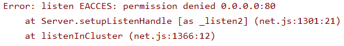
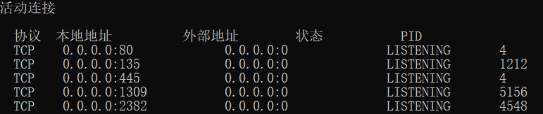
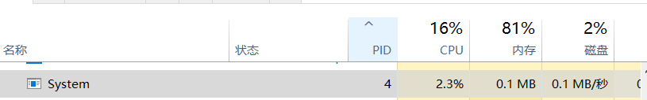

最近在学习node的时候，在写http服务，发现监听http默认端口号80出现了错误  

  

通过查询错误，发现了是80端口号**被系统的进程占用**了  

具体查询方式如下：  

**打开cmd命令行窗口**  
:::tip  
输入 netstat -ano 查看本机端口的使用情况
:::  
  
  

可以看到，端口80被进程标识（PID）为4的进程占用了  

**打开任务管理器**  
通过筛选PID，可以查看PID为4的是System进程  

  

但是，无法通过显示关闭来结束System进程  

可以去注册表中找到http服务，然后将PID号改成其他的  

但是我目前只是练习阶段，为什么不换一个端口号用呢？O(∩_∩)O

